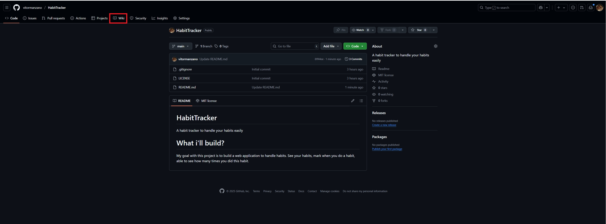

# HabitTracker
A habit tracker to handle your habits easily

# What i'll build?

My goal with this project is to build a web application to handle habits.
See your habits, mark when you do a habit, able to see how many times you did this habit.

Check more in the Wiki!

# How to access the Wiki? 
In the top bar of the page you'll see many services in my repository, find the one who looks like a book and calls Wiki

